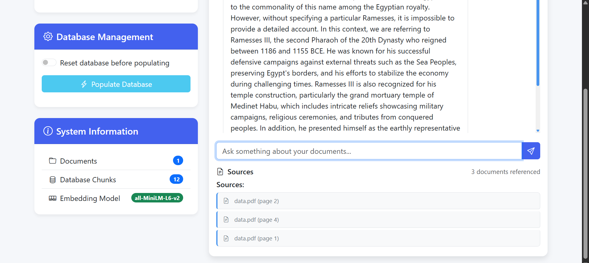

# Document Explorer 🗂️🔍

An AI-powered document query system that lets you search through your documents using natural language.



## Features ✨

- 📤 Upload PDF, TXT, CSV, and DOCX files
- 🧠 Query documents using Mistral LLM via Ollama
- 🔍 Semantic search powered by ChromaDB
- 📊 Track document and chunk statistics
- ♻️ Database reset and repopulation
- 📑 Source citation for all answers

## Tech Stack ⚙️

| Component          | Technology               |
|--------------------|--------------------------|
| Backend Framework  | Flask (Python)           |
| Vector Database    | ChromaDB                 |
| Embeddings         | all-MiniLM-L6-v2         |
| LLM                | Mistral (via Ollama)     |
| Frontend           | Bootstrap 5 + JavaScript |
| Document Processing| LangChain                |

## Installation 🛠️

### Prerequisites
- Python 3.8+
- Ollama running locally
- Node.js (optional for frontend dev)

```bash
# Clone the repository
git clone https://github.com/yourusername/document-explorer.git
cd document-explorer

# Create virtual environment
python -m venv venv
source venv/bin/activate  # Windows: venv\Scripts\activate

# Install dependencies
pip install -r requirements.txt

# Set up Ollama (if not installed)
curl -fsSL https://ollama.com/install.sh | sh
ollama pull mistral

# Run the application
python backend/app.py
